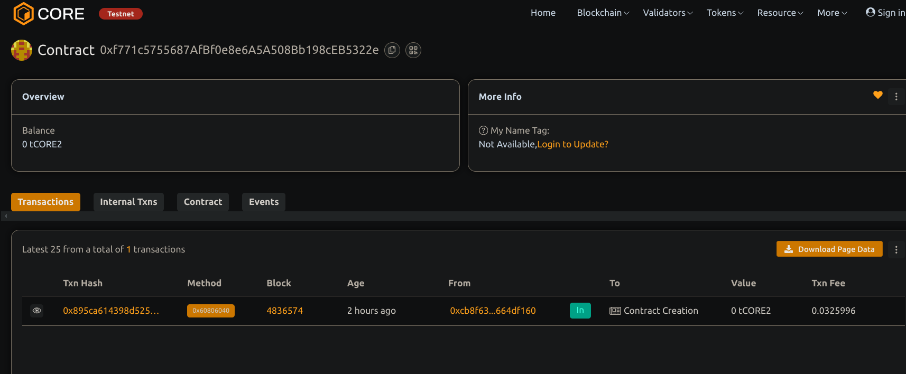

# Simple Cryptocurrency Token

## Project Title
Simple Cryptocurrency Token with Basic Transfer Functionality

## Project Description
This project implements a lightweight cryptocurrency token on the Ethereum blockchain using Solidity. The token follows the basic ERC20-like standard, providing essential functionality for token transfers between addresses. It's designed to be straightforward, secure, and easy to understand, making it perfect for educational purposes or as a foundation for more complex token implementations.

## Project Vision
The vision for this project is to create an accessible entry point into cryptocurrency development by providing a clean, well-documented implementation of a token contract. By focusing on simplicity and core functionality, we aim to help developers understand the fundamentals of token economics and blockchain interactions without the complexity of more advanced features.

## Key Features
- **Simple token creation**: Easily deploy a new token with customizable name, symbol, decimals, and initial supply
- **Balance tracking**: Maintain accurate balances for all token holders
- **Transfer functionality**: Allow users to send tokens to other addresses securely
- **Approval mechanism**: Enable the delegation of token spending to other addresses
- **Security checks**: Prevent common errors like transfers to zero addresses or spending more tokens than available
- **Events**: Emit standardized events for transfers and approvals to facilitate off-chain monitoring

## Future Scope
- **Token burning**: Implement functionality to permanently remove tokens from circulation
- **Minting mechanism**: Add the ability to create new tokens after initial deployment
- **Pausable transfers**: Allow contract administrators to temporarily pause token transfers in emergency situations
- **Timelock features**: Implement vesting schedules for gradual token release
- **Governance integration**: Enable token holders to vote on protocol decisions
- **Fee mechanisms**: Add optional transfer fees for sustainability or redistribution
- **Enhanced security**: Implement additional security features like rate limiting or blacklisting
- **Cross-chain compatibility**: Explore bridge solutions to make the token usable across multiple blockchains

## Contract details
0xf771c5755687AfBf0e8e6A5A508Bb198cEB5322e
